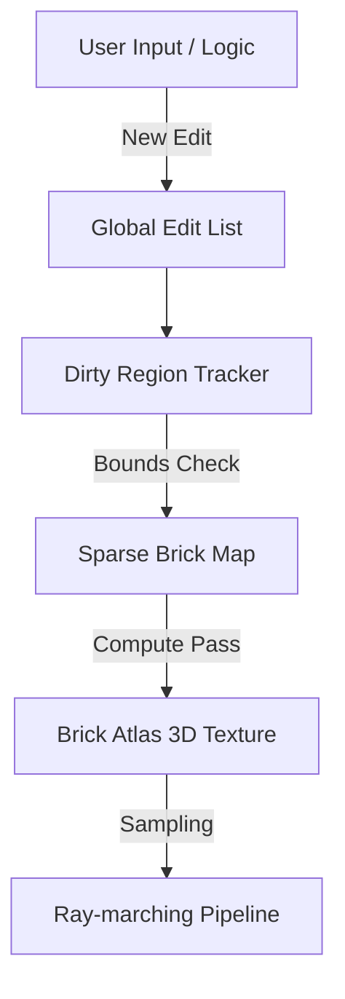

# Architecture & Spatial Indexing

The SDF-Dynamic engine uses a multi-layered spatial representation to balance the mathematical precision of SDFs with the performance requirements of real-time rendering.

## 1. The Edit Paradigm (Source of Truth)

Unlike traditional engines that store vertex data, our engine stores an **Edit List**.

- **Non-Destructive**: Every operation (digging a hole, adding a wall) is an entry in a list.
- **Dynamic**: Moving an object simply means updating its transformation matrix in the list.
- **Mathematical**: Surfaces are defined by functions (e.g., `dist = length(p) - radius`).

### Mermaid Workflow: Edit to Voxel

## 2. Sparse Brick-Maps (Spatial Index)

The world is divided into a grid of **Bricks**. Each brick is an 8x8x8 voxel volume.

- **Empty Bricks**: Skips evaluation and rendering (highly efficient for air/solid underground).
- **Surface Bricks**: Contain pointers to the **Brick Atlas** where actual distance values are stored.
- **LOD Levels**: Brick-Maps are nested (Clipmaps). Outer levels represent larger world areas with lower resolution.

## 3. The Brick Atlas (Physical Storage)

The Brick Atlas is a large 3D texture acting as a physical cache.

- **Data Format**: `R16_FLOAT` (Distance) + `G8_UINT` (Material ID).
- **Trilinear Filtering**: Hardware-accelerated sampling ensures smooth surfaces even at moderate voxel density.
- **Allocation**: A "Free List" management system on the GPU handles the allocation/deallocation of bricks as the camera moves.

## 4. Coordinate Systems

- **World Space**: Global coordinates.
- **Clipmap Space**: Camera-relative nested grids.
- **Brick Space**: 0.0 to 1.0 within a specific atlas entry.
- **Voxel Space**: 0 to 7 (integer) for compute evaluations.
