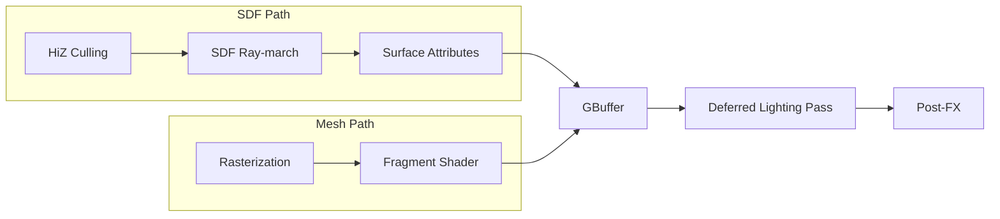

# Rendering & Pipeline

The engine utilizes a hybrid pipeline designed to maximize the visual quality of SDF volumes while supporting standard mesh-based assets.

## 1. Hybrid Rendering Pipeline

Surface representation is handled by two distinct paths that converge in a common **Deferred G-Buffer**.

### Mermaid Pipeine


## 2. SDF Ray-marching Optimizations

Performing a naive ray-march through a 3D texture is expensive. We employ several optimizations:

- **Empty Space Skipping**: The Sparse Brick-Map allows rays to "jump" over 8x8x8 blocks of air instantaneously.
- **HiZ Occlusion**: Before marching, the depth from the previous frame's Hierarchical Z-Buffer is used to discard rays that are definitively occluded by closer geometry.
- **Adaptive Step Size**: Steps are determined by the distance field value (`dist = sample(p)`), but capped to ensure no surface is missed when entering a new brick.

## 3. PBR Integration

Our SDFs are not just "shapes"; they carry full PBR material properties.

- **Storage**: Material properties are cached in the Brick Atlas or looked up via a `MaterialID` buffer.
- **Normals**: Computed using **Central Differences** on the GPU during the march step:
  ```glsl
  vec3 calcNormal(vec3 p) {
      const float h = 0.01;
      const vec2 k = vec2(1, -1);
      return normalize(
          k.xyy * getDist(p + k.xyy * h) +
          k.yyx * getDist(p + k.yyx * h) +
          k.yxy * getDist(p + k.yxy * h) +
          k.xxx * getDist(p + k.xxx * h)
      );
  }
  ```

## 4. SDF Global Illumination (SDFGI)

By leveraging the existing Brick Atlas, we can compute low-resolution global illumination.
- **Probe Grids**: Light probes sample the 3D distance field to detect occlusions.
- **Ray-traced Shadows**: Hard and soft shadows are generated by marching towards light sources within the distance field.
